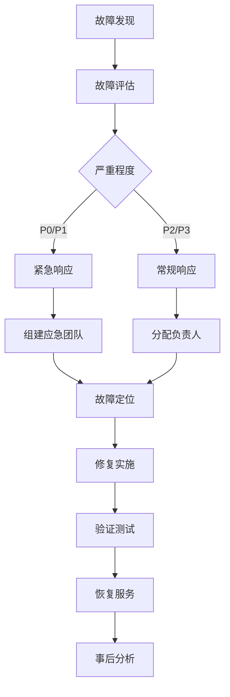

# YB Migration 开发工作流程

## 概述

本文档描述了 YB Migration 项目的完整开发工作流程，从环境设置到代码发布的每个环节。

## 目录

- [开发环境设置](#开发环境设置)
- [分支管理策略](#分支管理策略)
- [开发流程](#开发流程)
- [代码审查流程](#代码审查流程)
- [测试流程](#测试流程)
- [发布流程](#发布流程)
- [CI/CD 流程](#cicd-流程)
- [故障处理流程](#故障处理流程)

## 开发环境设置

### 1. 环境准备

#### 系统要求
- **操作系统**: Windows 10+, macOS 10.15+, Linux (Ubuntu 18.04+)
- **Go 版本**: 1.25.1+
- **Git 版本**: 2.0+
- **内存**: 最少 4GB，推荐 8GB+
- **存储**: 最少 2GB 可用空间

#### 安装 Go
```bash
# macOS (使用 Homebrew)
brew install go@1.25

# Ubuntu/Debian
sudo apt update
sudo apt install golang-1.25-go

# Windows (使用 Chocolatey)
choco install golang

# 验证安装
go version
```

#### 配置 Go 环境
```bash
# 设置 GOPATH (Go 1.11+ 可选)
export GOPATH=$HOME/go
export PATH=$PATH:$GOPATH/bin

# 设置代理 (中国用户)
export GOPROXY=https://goproxy.cn,direct
export GOSUMDB=sum.golang.org

# 验证配置
go env
```

### 2. 项目设置

#### 克隆项目
```bash
git clone https://github.com/musicalzhu/yb-migration.git
cd yb-migration
```

#### 安装开发工具
```bash
# 安装必需工具
go install github.com/golangci/golangci-lint/cmd/golangci-lint@latest
go install github.com/daixiang0/gci@latest
go install github.com/swaggo/swag/cmd/swag@latest

# 安装可选工具
go install github.com/go-delve/delve/cmd/dlv@latest
go install github.com/golang/mock/mockgen@latest
```

#### 配置 IDE
```bash
# VS Code 扩展
code --install-extension golang.go
code --install-extension ms-vscode.vscode-json
code --install-extension redhat.vscode-yaml

# 创建 VS Code 配置
mkdir -p .vscode
cat > .vscode/settings.json << EOF
{
    "go.useLanguageServer": true,
    "go.formatTool": "goimports",
    "go.lintTool": "golangci-lint",
    "go.testFlags": ["-v"],
    "go.coverOnSave": true
}
EOF
```

### 3. 验证环境

```bash
# 检查依赖
go mod tidy

# 运行测试
go test -v ./...

# 运行代码检查
golangci-lint run

# 构建项目
go build -o ybMigration cmd/main.go
```

## 分支管理策略

### 分支类型

#### main 分支
- **用途**: 主开发分支，保持稳定可发布状态
- **保护**: 禁止直接推送，只能通过 PR 合并
- **要求**: 所有检查必须通过

#### develop 分支
- **用途**: 开发集成分支
- **保护**: 禁止直接推送，只能通过 PR 合并
- **要求**: 基础测试必须通过

#### feature 分支
- **用途**: 新功能开发
- **命名**: `feature/功能描述`
- **来源**: 从 develop 分支创建
- **去向**: 合并到 develop 分支

#### hotfix 分支
- **用途**: 紧急修复
- **命名**: `hotfix/问题描述`
- **来源**: 从 main 分支创建
- **去向**: 合并到 main 和 develop 分支

#### release 分支
- **用途**: 发布准备
- **命名**: `release/版本号`
- **来源**: 从 develop 分支创建
- **去向**: 合并到 main 分支

### 分支工作流

```bash
# 1. 创建功能分支
git checkout develop
git pull origin develop
git checkout -b feature/new-checker

# 2. 开发功能
# ... 编写代码 ...

# 3. 提交代码
git add .
git commit -m "feat: 添加新的检查器"

# 4. 推送分支
git push origin feature/new-checker

# 5. 创建 PR
# 在 GitHub/GitLab 创建 Pull Request

# 6. 合并后清理
git checkout develop
git pull origin develop
git branch -d feature/new-checker
git push origin --delete feature/new-checker
```

## 开发流程

### 1. 需求分析

#### 创建 Issue
```markdown
## 功能需求
- **标题**: 添加新的数据类型检查器
- **描述**: 检查 MySQL 特有的数据类型并提供转换建议
- **优先级**: 高
- **标签**: enhancement, checker

## 验收标准
- [ ] 检测 ENUM 类型
- [ ] 检测 SET 类型
- [ ] 提供转换建议
- [ ] 添加单元测试
- [ ] 更新文档

## 技术要求
- 遵循现有的 Checker 接口
- 支持配置化
- 性能要求：处理 1000 行 SQL < 1s
```

#### 技术设计
```markdown
## 技术设计

### 接口设计
```go
type DatatypeChecker struct {
    config map[string]interface{}
}

func (c *DatatypeChecker) Check(stmt model.SQLStatement) []model.Issue
```

### 实现方案
1. 解析 CREATE TABLE 语句
2. 提取列定义
3. 检查数据类型兼容性
4. 生成转换建议

### 测试策略
- 单元测试：覆盖所有数据类型
- 集成测试：端到端验证
- 性能测试：大文件处理
```

### 2. 开发实施

#### 创建分支
```bash
git checkout develop
git pull origin develop
git checkout -b feature/datatype-checker
```

#### 编写代码
```go
// internal/checker/datatype_checker.go
package checker

import (
    "fmt"
    "strings"
    "github.com/example/ybMigration/internal/model"
)

type DatatypeChecker struct {
    name        string
    config      map[string]interface{}
    unsupported map[string]string
}

func NewDatatypeChecker() *DatatypeChecker {
    return &DatatypeChecker{
        name: "datatype_incompatibility",
        unsupported: map[string]string{
            "ENUM":   "VARCHAR",
            "SET":    "VARCHAR",
            "TINYBLOB": "BLOB",
            "MEDIUMBLOB": "BLOB",
            "LONGBLOB": "BLOB",
        },
    }
}

func (c *DatatypeChecker) Check(stmt model.SQLStatement) []model.Issue {
    var issues []model.Issue
    
    if stmt.Type != "CREATE_TABLE" {
        return issues
    }
    
    for _, column := range stmt.Columns {
        if replacement, exists := c.unsupported[strings.ToUpper(column.Type)]; exists {
            issues = append(issues, model.Issue{
                Checker:    c.GetName(),
                Category:   c.GetCategory(),
                Severity:   "warning",
                Message:    fmt.Sprintf("数据类型 %s 在目标数据库中不兼容", column.Type),
                LineNumber: column.LineNumber,
                Column:     column.Column,
                Suggestion: fmt.Sprintf("建议使用 %s 替代 %s", replacement, column.Type),
                RuleID:     "DT_001",
            })
        }
    }
    
    return issues
}

// 实现其他接口方法...
```

#### 编写测试
```go
// internal/checker/datatype_checker_test.go
package checker

import (
    "testing"
    "github.com/example/ybMigration/internal/model"
    "github.com/stretchr/testify/assert"
    "github.com/stretchr/testify/require"
)

func TestDatatypeChecker_Check(t *testing.T) {
    checker := NewDatatypeChecker()
    
    tests := []struct {
        name     string
        stmt     model.SQLStatement
        expected int
    }{
        {
            name: "ENUM 类型检测",
            stmt: model.SQLStatement{
                Type: "CREATE_TABLE",
                Columns: []model.Column{
                    {Type: "ENUM('a','b','c')", LineNumber: 1, Column: 10},
                },
            },
            expected: 1,
        },
        {
            name: "兼容类型不报错",
            stmt: model.SQLStatement{
                Type: "CREATE_TABLE",
                Columns: []model.Column{
                    {Type: "VARCHAR(255)", LineNumber: 1, Column: 10},
                },
            },
            expected: 0,
        },
    }
    
    for _, tt := range tests {
        t.Run(tt.name, func(t *testing.T) {
            issues := checker.Check(tt.stmt)
            assert.Len(t, issues, tt.expected)
            
            if tt.expected > 0 {
                assert.Equal(t, "datatype_incompatibility", issues[0].Checker)
                assert.Equal(t, "warning", issues[0].Severity)
            }
        })
    }
}
```

### 3. 本地验证

#### 运行测试
```bash
# 运行特定包测试
go test -v ./internal/checker

# 运行所有测试
go test -v ./...

# 生成覆盖率报告
go test -coverprofile=coverage.out ./internal/checker
go tool cover -html=coverage.out -o coverage.html
```

#### 代码检查
```bash
# 运行 golangci-lint
golangci-lint run ./internal/checker

# 格式化代码
gci write -s standard -s default -s "prefix(github.com/example/ybMigration)" ./internal/checker
goimports -w ./internal/checker
```

#### 集成测试
```bash
# 构建项目
go build -o ybMigration cmd/main.go

# 测试新功能
./ybMigration --config testdata/config.yaml testdata/sample.sql
```

## 代码审查流程

### 1. 创建 Pull Request

#### PR 模板
```markdown
## 变更描述
简要描述本次变更的内容和目的。

## 变更类型
- [ ] 新功能 (feature)
- [ ] 修复 (fix)
- [ ] 文档 (docs)
- [ ] 样式 (style)
- [ ] 重构 (refactor)
- [ ] 测试 (test)
- [ ] 构建 (build)

## 测试
- [ ] 单元测试通过
- [ ] 集成测试通过
- [ ] 手动测试完成

## 检查清单
- [ ] 代码遵循项目规范
- [ ] 添加了必要的测试
- [ ] 更新了相关文档
- [ ] 没有引入新的警告
- [ ] 性能影响可接受

## 相关 Issue
Closes #123

## 截图 (如适用)
添加相关截图或 GIF。

## 额外说明
任何审查者需要知道的信息。
```

### 2. 代码审查

#### 审查要点

##### 功能性
- [ ] 功能是否按预期工作
- [ ] 边界情况是否处理
- [ ] 错误处理是否完善
- [ ] 性能是否满足要求

##### 代码质量
- [ ] 代码是否清晰易读
- [ ] 命名是否规范
- [ ] 注释是否充分
- [ ] 是否遵循 Go 最佳实践

##### 测试
- [ ] 测试覆盖率是否足够
- [ ] 测试是否有意义
- [ ] 是否有集成测试
- [ ] 测试是否可维护

##### 安全性
- [ ] 是否有安全漏洞
- [ ] 输入验证是否充分
- [ ] 权限控制是否合理

### 3. 审查反馈

#### 反馈类型
```markdown
## 必须修复 (Must Fix)
- 严重错误或安全问题
- 功能不完整或错误
- 性能严重问题

## 建议修复 (Should Fix)
- 代码质量问题
- 测试不足
- 文档缺失

## 可以改进 (Could Fix)
- 代码优化建议
- 命名改进
- 注释补充
```

#### 反馈示例
```markdown
### 必须修复
1. **错误处理**: `ParseSQL` 函数没有处理空字符串的情况
   ```go
   // 当前代码
   func ParseSQL(sql string) ([]SQLStatement, error) {
       return parser.Parse(sql)
   }
   
   // 建议修改
   func ParseSQL(sql string) ([]SQLStatement, error) {
       if strings.TrimSpace(sql) == "" {
           return nil, errors.New("SQL 不能为空")
       }
       return parser.Parse(sql)
   }
   ```

### 建议修复
1. **测试覆盖**: `DatatypeChecker` 缺少边界情况测试
   - 添加空表定义测试
   - 添加无效数据类型测试

### 可以改进
1. **性能优化**: 可以使用 map 替代 slice 查找
   ```go
   // 当前 O(n) 查找
   for _, unsupported := range unsupportedTypes {
       if strings.EqualFold(columnType, unsupported) {
           // 处理
       }
   }
   
   // 建议 O(1) 查找
   if replacement, exists := unsupportedMap[strings.ToUpper(columnType)]; exists {
       // 处理
   }
   ```
```

## 测试流程

### 1. 测试策略

#### 测试金字塔
```
    /\
   /  \     E2E Tests (少量)
  /____\    
 /      \   Integration Tests (适量)
/__________\ Unit Tests (大量)
```

#### 测试分类
- **单元测试**: 测试单个函数或方法
- **集成测试**: 测试多个组件的协作
- **端到端测试**: 测试完整的工作流程
- **性能测试**: 测试性能指标
- **安全测试**: 测试安全漏洞

### 2. 测试实施

#### 单元测试
```go
// 测试文件命名: *_test.go
func TestFunctionName(t *testing.T) {
    // 准备
    input := "test input"
    expected := "expected output"
    
    // 执行
    result, err := FunctionName(input)
    
    // 验证
    require.NoError(t, err)
    assert.Equal(t, expected, result)
}
```

#### 集成测试
```go
func TestAnalyzer_Integration(t *testing.T) {
    if testing.Short() {
        t.Skip("跳过集成测试")
    }
    
    // 设置测试环境
    config := setupTestConfig(t)
    defer cleanupTestConfig(t)
    
    // 执行完整流程
    result, err := AnalyzeInput("testdata/sample.sql", parser, checkers)
    
    // 验证结果
    require.NoError(t, err)
    assert.NotEmpty(t, result.Issues)
}
```

#### 性能测试
```go
func BenchmarkAnalyzer_Analyze(b *testing.B) {
    analyzer := setupAnalyzer()
    input := generateLargeSQL(1000) // 1000 行 SQL
    
    b.ResetTimer()
    for i := 0; i < b.N; i++ {
        _, err := analyzer.Analyze(input)
        if err != nil {
            b.Fatal(err)
        }
    }
}
```

### 3. 测试执行

#### 本地测试
```bash
# 运行所有测试
go test -v ./...

# 运行特定包测试
go test -v ./internal/checker

# 运行特定测试函数
go test -v ./internal/checker -run TestDatatypeChecker

# 运行基准测试
go test -bench=. ./internal/analyzer

# 生成覆盖率报告
go test -coverprofile=coverage.out ./...
go tool cover -html=coverage.out -o coverage.html
```

#### CI 测试
```yaml
# .github/workflows/test.yml
name: Test
on: [push, pull_request]

jobs:
  test:
    runs-on: ubuntu-latest
    strategy:
      matrix:
        go-version: [1.25, 1.26]
    
    steps:
    - uses: actions/checkout@v3
    
    - name: Set up Go
      uses: actions/setup-go@v3
      with:
        go-version: ${{ matrix.go-version }}
    
    - name: Cache Go modules
      uses: actions/cache@v3
      with:
        path: ~/go/pkg/mod
        key: ${{ runner.os }}-go-${{ hashFiles('**/go.sum') }}
    
    - name: Install dependencies
      run: go mod download
    
    - name: Run tests
      run: go test -v -race -coverprofile=coverage.out ./...
    
    - name: Upload coverage
      uses: codecov/codecov-action@v3
      with:
        file: ./coverage.out
```

## 发布流程

### 1. 版本规划

#### 版本类型
- **主版本**: 不兼容的 API 修改
- **次版本**: 向下兼容的功能性新增
- **修订版本**: 向下兼容的问题修正

#### 发布周期
- **主版本**: 6-12 个月
- **次版本**: 1-3 个月
- **修订版本**: 按需发布

### 2. 发布准备

#### 检查清单
```markdown
## 发布前检查

### 代码质量
- [ ] 所有测试通过
- [ ] 代码覆盖率 > 80%
- [ ] 无 lint 错误
- [ ] 无安全漏洞

### 文档
- [ ] API 文档更新
- [ ] README 更新
- [ ] CHANGELOG 更新
- [ ] 版本说明更新

### 构建
- [ ] 本地构建成功
- [ ] 交叉编译成功
- [ ] 安装包生成
- [ ] 签名验证

### 测试
- [ ] 单元测试通过
- [ ] 集成测试通过
- [ ] 端到端测试通过
- [ ] 性能测试通过
```

#### 版本号更新
```bash
# 更新版本号
git checkout main
git pull origin main

# 更新 go.mod 中的版本
# 更新文档中的版本号
# 更新 CHANGELOG

# 提交版本更新
git add .
git commit -m "chore: 准备发布 v2.1.0"
```

### 3. 发布执行

#### 创建发布标签
```bash
# 创建标签
git tag -a v2.1.0 -m "Release v2.1.0

## 新功能
- 添加数据类型检查器
- 支持批量文件处理

## 修复
- 修复内存泄漏问题
- 修复配置文件解析错误

## 改进
- 性能优化 20%
- 改进错误信息"

# 推送标签
git push origin v2.1.0
```

#### 自动化发布
```yaml
# .github/workflows/release.yml
name: Release
on:
  push:
    tags:
      - 'v*'

jobs:
  release:
    runs-on: ubuntu-latest
    steps:
    - uses: actions/checkout@v3
    
    - name: Set up Go
      uses: actions/setup-go@v3
      with:
        go-version: 1.25
    
    - name: Build
      run: |
        make build-all
    
    - name: Create Release
      uses: actions/create-release@v3
      env:
        GITHUB_TOKEN: ${{ secrets.GITHUB_TOKEN }}
      with:
        tag_name: ${{ github.ref }}
        release_name: Release ${{ github.ref }}
        draft: false
        prerelease: false
    
    - name: Upload Assets
      uses: actions/upload-release-asset@v3
      env:
        GITHUB_TOKEN: ${{ secrets.GITHUB_TOKEN }}
      with:
        upload_url: ${{ steps.create_release.outputs.upload_url }}
        asset_path: ./bin/ybMigration-linux-amd64
        asset_name: ybMigration-linux-amd64
        asset_content_type: application/octet-stream
```

## CI/CD 流程

### 1. 持续集成

#### 触发条件
- 推送到 main/develop 分支
- 创建 Pull Request
- 创建标签

#### 流水线阶段
```yaml
stages:
  - lint          # 代码检查
  - test          # 测试
  - security      # 安全检查
  - build         # 构建
  - deploy        # 部署
```

#### GitLab CI 配置
```yaml
# .gitlab-ci.yml
stages:
  - lint
  - test
  - security
  - build
  - deploy

variables:
  GO_VERSION: "1.25"
  GOPROXY: "https://goproxy.cn,direct"

# 代码检查
lint:
  stage: lint
  image: golang:$GO_VERSION
  script:
    - go install github.com/golangci/golangci-lint/cmd/golangci-lint@latest
    - golangci-lint run
  only:
    - merge_requests
    - main
    - develop

# 测试
test:
  stage: test
  image: golang:$GO_VERSION
  services:
    - mysql:8.0
  variables:
    MYSQL_ROOT_PASSWORD: password
    MYSQL_DATABASE: test
  script:
    - go test -v -race -coverprofile=coverage.out ./...
    - go tool cover -func=coverage.out
  coverage: '/total:.*?(\d+\.\d+)%/'
  artifacts:
    reports:
      coverage_report:
        coverage_format: cobertura
        path: coverage.xml
  only:
    - merge_requests
    - main
    - develop

# 安全检查
security:
  stage: security
  image: golang:$GO_VERSION
  script:
    - go install github.com/securecodewarrior/gosec/v2/cmd/gosec@latest
    - gosec ./...
  only:
    - merge_requests
    - main
    - develop

# 构建
build:
  stage: build
  image: golang:$GO_VERSION
  script:
    - make build-all
  artifacts:
    paths:
      - bin/
    expire_in: 1 week
  only:
    - main
    - develop
    - tags

# 部署
deploy:
  stage: deploy
  image: alpine:latest
  script:
    - echo "部署到生产环境"
  only:
    - tags
  when: manual
```

### 2. 持续部署

#### 环境管理
- **开发环境**: 自动部署
- **测试环境**: 自动部署
- **预生产环境**: 手动部署
- **生产环境**: 手动部署

#### 部署策略
```yaml
# 蓝绿部署
deploy-blue-green:
  stage: deploy
  script:
    - echo "部署到绿色环境"
    - echo "健康检查"
    - echo "切换流量"
  environment:
    name: production
    url: https://api.yb-migration.com
  when: manual
```

## 故障处理流程

### 1. 故障分类

#### 严重程度
- **P0 - 严重**: 系统不可用，数据丢失
- **P1 - 高**: 核心功能不可用，严重影响用户
- **P2 - 中**: 部分功能不可用，影响部分用户
- **P3 - 低**: 小问题，不影响主要功能

#### 故障类型
- **代码缺陷**: 程序错误
- **性能问题**: 响应慢，资源占用高
- **安全漏洞**: 安全风险
- **配置错误**: 配置问题
- **基础设施**: 服务器、网络问题

### 2. 故障响应

#### 响应流程


#### 应急响应
```bash
# 1. 快速回滚
git revert <commit-hash>
git push origin main

# 2. 热修复
git checkout -b hotfix/urgent-fix
# 修复代码
git add .
git commit -m "hotfix: 紧急修复"
git push origin hotfix/urgent-fix

# 3. 创建紧急 PR
# 快速审查和合并

# 4. 发布修复版本
git tag -a v2.1.1 -m "Hotfix: 紧急修复"
git push origin v2.1.1
```

### 3. 事后分析

#### 分析报告
```markdown
# 故障分析报告

## 故障概述
- **时间**: 2026-02-03 14:30:00
- **持续时间**: 45 分钟
- **影响范围**: 30% 用户
- **严重程度**: P1

## 故障原因
### 根本原因
- 配置文件解析错误导致服务启动失败

### 直接原因
- 新版本配置格式变更，向后兼容性处理不当

## 影响评估
- 用户影响：30% 用户无法使用服务
- 业务影响：订单处理中断
- 数据影响：无数据丢失

## 处理过程
1. 14:30 - 监控告警
2. 14:35 - 确认故障
3. 14:40 - 开始回滚
4. 14:45 - 服务恢复
5. 15:00 - 问题定位
6. 15:15 - 修复完成

## 改进措施
### 短期措施
- [ ] 增加配置文件验证
- [ ] 改进错误处理
- [ ] 完善监控告警

### 长期措施
- [ ] 配置版本管理
- [ ] 灰度发布
- [ ] 自动化测试

## 经验教训
1. 配置变更需要更严格的测试
2. 需要更好的向后兼容性处理
3. 监控告警需要更及时
```

---

## 📚 **相关资源**

### 工具文档
- [Git 工作流](https://www.atlassian.com/git/tutorials/comparing-workflows)
- [Go 测试](https://golang.org/pkg/testing/)
- [golangci-lint](https://golangci-lint.run/)

### 最佳实践
- [Conventional Commits](https://www.conventionalcommits.org/)
- [语义化版本](https://semver.org/)
- [GitLab CI/CD](https://docs.gitlab.com/ee/ci/)

---

*最后更新: 2026-02-03*  
*维护者: YB Migration Team*
